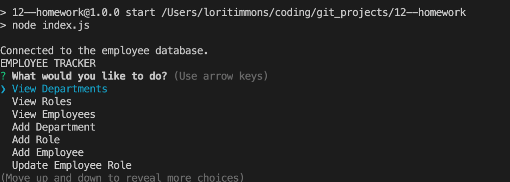

# 12--homework - Lori Timmons 
## Table of Contents 
* [Description](#Description)   
* [Installation](#Installation) 
* [Usage](#Usage) 
* [Questions / Issues](#Questions) 

  ## Description
  This projects is designed to help an organization keep track of their employees. With this application you can view, add and update an employee roles. 
  ## Installation
  To create this you need to work in the nodes modules and require the inquirer package, express, dotenv, console.table and mySQL12. Install
    ## Usage
  Use this application to create an awesome README file.   Demonstration Video: [Watch the Demo]() 
    

  ## Questions
  #### Contact Me @: lorietimmons@gmail.com 
  #### GitHub Profile: LoriTimmons
  #### GitHub Repo Link: https://github.com/LoriTimmons/12--homework
  #### Demo: 